# Multi-Hop VPN Infrastructure

Multi-cloud, multi-hop VPN chain deployment using Terraform, Ansible, OpenVPN, and WireGuard across DigitalOcean and AWS.

---

## Table of Contents

1. [Introduction](#introduction)
2. [Architecture](#architecture)
3. [Prerequisites](#prerequisites)
4. [Installation](#installation)
5. [Credential Setup](#credential-setup)
6. [Usage](#usage)
7. [Chain Configuration Examples](#chain-configuration-examples)
8. [Make Targets Reference](#make-targets-reference)
9. [Verification and Testing](#verification-and-testing)
10. [Repository Structure](#repository-structure)
11. [Security Considerations](#security-considerations)
12. [Cost Estimates](#cost-estimates)
13. [License](#license)

---

## Introduction

This project is an Infrastructure-as-Code (IaC) implementation of a **multi-hop VPN chain** that can be deployed across multiple cloud providers. The system routes client traffic through a series of encrypted tunnels so that **no single node in the chain can observe both the client's real IP address and the traffic's final destination**. This property is known as traffic analysis resistance.

The architecture combines two VPN technologies:

- **OpenVPN** serves as the client-facing entry point. Users connect with standard OpenVPN clients using `.ovpn` configuration files generated by the project's PKI tooling.
- **WireGuard** forms the inter-node tunnel backbone. Each adjacent pair of nodes in the chain is connected by a WireGuard point-to-point tunnel, providing high-performance encrypted forwarding.

The infrastructure is fully defined in code. **Terraform** provisions cloud resources (droplets, EC2 instances, firewalls, security groups, SSH keys) on DigitalOcean and/or AWS. **Ansible** handles all post-provisioning configuration: OS hardening, VPN software installation, key exchange, tunnel setup, and routing rules. A set of shell scripts wraps Easy-RSA for local PKI management, ensuring that the Certificate Authority private key never leaves the operator's machine.

The project supports chains of any length: a minimum of 2 nodes (entry + exit) and no upper limit on relay nodes. Nodes can be mixed freely between DigitalOcean and AWS, enabling geographic distribution across different providers and regions.

---

## Architecture

### High-Level Data Flow

```
                                    WireGuard Tunnel Backbone
                          ┌──────────────────────────────────────────┐
                          │                                          │
 ┌────────┐  OpenVPN   ┌──┴──────┐  WireGuard  ┌──────────┐  WireGuard  ┌──┴──────┐   NAT    ┌──────────┐
 │ Client  ├───────────►│  Entry  ├────────────►│  Relay   ├────────────►│  Exit   ├─────────►│ Internet │
 │         │  UDP 1194  │  Node   │  UDP 51820  │  Node(s) │  UDP 51820 │  Node   │          │          │
 └────────┘            └─────────┘             └──────────┘            └─────────┘          └──────────┘
                        tun0 ─► wg0            wg_in ─► wg_out         wg0 ─► eth0
```

### Node Roles

| Role | Interfaces | Function |
|------|-----------|----------|
| **Entry** | `tun0` (OpenVPN) + `wg0` (WireGuard out) | Accepts client connections, forwards traffic into the WireGuard chain |
| **Relay** | `wg_in` (WireGuard in) + `wg_out` (WireGuard out) | Forwards traffic between adjacent tunnels. Sees neither source nor destination |
| **Exit** | `wg0` (WireGuard in) + `eth0` (internet) | Receives traffic from the chain, NAT masquerades to the public internet |

Roles are **not user-configured**. They are determined automatically by position: the first node in the chain is always entry, the last is always exit, and everything in between is a relay.

### Network Addressing

| Network | CIDR | Purpose |
|---------|------|---------|
| OpenVPN client subnet | `10.8.0.0/24` | IP pool for connected VPN clients |
| WireGuard tunnels | `10.0.0.0/16` | /30 subnets allocated per hop (auto-computed) |

### Tunnel Pair Addressing

Each adjacent pair of nodes in the chain receives a `/30` subnet carved from `10.0.0.0/16`. For a 3-node chain:

```
Entry (10.0.0.1/30) ──── wg tunnel ──── Relay (10.0.0.2/30)
Relay (10.0.0.5/30) ──── wg tunnel ──── Exit  (10.0.0.6/30)
```

### Security Model

```
 What the Entry node sees:     Client IP ──────►  ?????
 What the Relay node sees:     ?????     ──────►  ?????
 What the Exit node sees:      ?????     ──────►  Destination
```

No single node has visibility into both the client's origin IP and the final destination. This is the core privacy property of the multi-hop design.

---

## Prerequisites

The following tools must be installed on the operator's local machine before using this project:

| Tool | Minimum Version | Purpose |
|------|----------------|---------|
| [Terraform](https://www.terraform.io/downloads) | >= 1.5 | Cloud infrastructure provisioning |
| [Ansible](https://docs.ansible.com/ansible/latest/installation_guide/) | >= 2.15 | Node configuration management |
| [GNU Make](https://www.gnu.org/software/make/) | any | Task automation |
| `curl` | any | Used by PKI scripts to download Easy-RSA |
| SSH key pair | Ed25519 recommended | Authentication to provisioned nodes |

**Easy-RSA** is downloaded automatically when running `make pki-init` — no manual installation required.

You will also need at least one of the following cloud accounts:

- **DigitalOcean** account with an API token (read + write permissions)
- **AWS** account with IAM credentials (programmatic access to EC2)

---

## Installation

### 1. Clone the Repository

```bash
git clone https://github.com/mikhailbahdashych/multi-hop-vpn-infrastructure.git
cd multi-hop-vpn-infrastructure
```

### 2. Verify Tool Versions

```bash
terraform --version   # Should show >= 1.5
ansible --version     # Should show >= 2.15
make --version        # Any version
```

### 3. Ensure SSH Key Exists

The project uses your local SSH key to authenticate with cloud nodes. By default, it looks for `~/.ssh/id_ed25519.pub`. If your key is in a different location, you will configure the path in `terraform.tfvars` (see [Credential Setup](#credential-setup)).

```bash
# Generate a key if you don't have one
ssh-keygen -t ed25519 -C "vpn-infrastructure"
```

### 4. Initialize Terraform

```bash
make init
```

This downloads the required Terraform providers (DigitalOcean, AWS, local).

---

## Credential Setup

### Create the Variables File

```bash
cp terraform.tfvars.example terraform/terraform.tfvars
```

Edit `terraform/terraform.tfvars` with your editor of choice. Below is a description of every variable.

### DigitalOcean

1. Log in to [DigitalOcean](https://cloud.digitalocean.com/).
2. Navigate to **API** > **Tokens** > **Generate New Token**.
3. Create a token with **read + write** scope.
4. Set the token in your tfvars:

```hcl
do_token = "dop_v1_your_token_here"
```

### AWS

Terraform reads credentials from your local `~/.aws/credentials` file, which is the standard location used by the AWS CLI. No environment variable exports are needed.

**1. Configure credentials with the AWS CLI** (if not already done):

```bash
aws configure
```

This prompts for your Access Key ID, Secret Access Key, default region, and output format, then writes them to `~/.aws/credentials` and `~/.aws/config`.

**2. Verify the credentials file exists:**

```bash
cat ~/.aws/credentials
```

It should look like this:

```ini
[default]
aws_access_key_id = AKIA...
aws_secret_access_key = your_secret_key
```

**3. If you use a named profile** (e.g. `[vpn-infra]` instead of `[default]`), set the profile name in your tfvars:

```hcl
aws_profile = "vpn-infra"
```

If omitted, the `default` profile is used.

**4. Optionally set the default AWS region** (defaults to `eu-central-1`):

```hcl
aws_region = "eu-central-1"
```

### SSH Key Path

If your public key is not at the default `~/.ssh/id_ed25519.pub`:

```hcl
ssh_public_key_path = "~/.ssh/id_rsa.pub"
```

### Full Example

```hcl
do_token            = "dop_v1_abc123..."
aws_profile         = "default"
aws_region          = "eu-central-1"
ssh_public_key_path = "~/.ssh/id_ed25519.pub"

vpn_chain = [
  { name = "entry-fra", provider = "digitalocean", region = "fra1" },
  { name = "exit-ams",  provider = "digitalocean", region = "ams3" }
]
```

---

## Usage

The full lifecycle is: **provision infrastructure** > **set up PKI** > **configure nodes** > **create client credentials** > **connect**.

### Step 1: Provision Cloud Infrastructure

```bash
# Preview what Terraform will create
make plan

# Create the infrastructure
make apply
```

Terraform provisions the nodes, SSH keys, firewalls/security groups, and generates the Ansible inventory.

### Step 2: Initialize the Local PKI

```bash
# Creates the Certificate Authority on your local machine
make pki-init
```

This downloads Easy-RSA, initializes a PKI directory under `pki/`, builds the CA, and generates DH parameters. **You will be prompted to set a CA passphrase** — remember it, you need it for signing certificates.

### Step 3: Generate the Server Certificate

```bash
make server-cert
```

Generates and signs the OpenVPN server certificate. The CA passphrase is required.

### Step 4: Configure All Nodes

```bash
make configure
```

Runs the full Ansible playbook suite against all nodes:
1. **Common** — OS updates, fail2ban, SSH hardening, IP forwarding
2. **WireGuard** — key generation, tunnel configuration, startup
3. **OpenVPN** — server installation and configuration (entry node only)
4. **Routing** — iptables rules per node role

### Step 5: Create a Client Certificate and Config

```bash
make client-cert CLIENT=laptop
make client-config CLIENT=laptop
```

The first command generates and signs a client certificate. The second produces a self-contained `clients/laptop.ovpn` file with all certificates and keys embedded.

### Step 6: Connect

Import the generated `.ovpn` file into any OpenVPN-compatible client:
- **macOS**: [Tunnelblick](https://tunnelblick.net/) or OpenVPN Connect
- **Linux**: `sudo openvpn --config clients/laptop.ovpn`
- **Windows**: [OpenVPN GUI](https://openvpn.net/community-downloads/)
- **iOS / Android**: OpenVPN Connect (import the `.ovpn` file)

### Teardown

```bash
make destroy
```

Removes all cloud resources. The local PKI and client configs are preserved.

---

## Chain Configuration Examples

The chain is defined as an ordered list in `terraform.tfvars`. The first element is always the entry node, the last is always the exit node, and any elements in between become relay nodes automatically.

### Minimal: 2-Node (DigitalOcean Only)

```hcl
vpn_chain = [
  { name = "entry-fra", provider = "digitalocean", region = "fra1" },
  { name = "exit-ams",  provider = "digitalocean", region = "ams3" }
]
```

### 3-Node with Relay (Mixed Providers)

```hcl
vpn_chain = [
  { name = "entry-fra",  provider = "digitalocean", region = "fra1" },
  { name = "relay-aws",  provider = "aws",          region = "eu-central-1" },
  { name = "exit-sgp",   provider = "digitalocean", region = "sgp1" }
]
```

### 4-Node Multi-Relay (Multi-Region)

```hcl
vpn_chain = [
  { name = "entry-nyc",   provider = "digitalocean", region = "nyc3" },
  { name = "relay-fra",   provider = "digitalocean", region = "fra1" },
  { name = "relay-aws",   provider = "aws",          region = "ap-southeast-1" },
  { name = "exit-sgp",    provider = "digitalocean", region = "sgp1" }
]
```

### Custom Instance Sizes

```hcl
vpn_chain = [
  { name = "entry-fra", provider = "digitalocean", region = "fra1", size = "s-2vcpu-2gb" },
  { name = "exit-aws",  provider = "aws",          region = "eu-west-1", size = "t3.small" }
]
```

Default sizes are `s-1vcpu-1gb` for DigitalOcean and `t3.micro` for AWS.

---

## Make Targets Reference

| Target | Description |
|--------|-------------|
| `make init` | Initialize Terraform (download providers) |
| `make plan` | Preview infrastructure changes |
| `make apply` | Provision all cloud infrastructure |
| `make destroy` | Tear down all cloud resources |
| `make pki-init` | Initialize local Easy-RSA Certificate Authority |
| `make server-cert` | Generate and sign the OpenVPN server certificate |
| `make client-cert CLIENT=<name>` | Generate and sign a client certificate |
| `make client-config CLIENT=<name>` | Produce a self-contained `.ovpn` client config file |
| `make configure` | Run the full Ansible playbook (all 4 phases) |
| `make deploy` | Full deployment shortcut (`apply` + `configure`) |
| `make status` | Ansible ping to verify all nodes are reachable |

---

## Verification and Testing

This section documents how to verify that the deployed infrastructure works correctly. Each step corresponds to a screenshot in the `static/` directory. Run these commands in order after completing the [Credential Setup](#credential-setup).

### 1. Terraform Init

```bash
make init
```

Screenshot the terminal output showing successful provider installation.

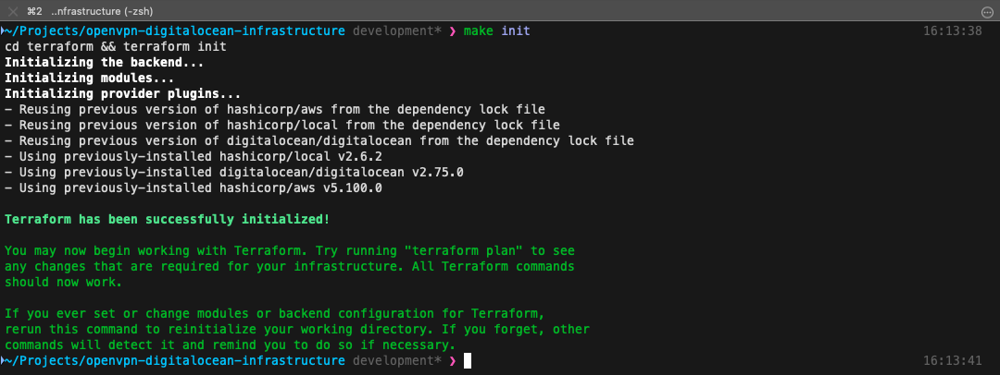

---

### 2. Terraform Plan

```bash
make plan
```

Screenshot the plan summary showing the number of resources to be created (droplets, firewalls, SSH keys, inventory file).

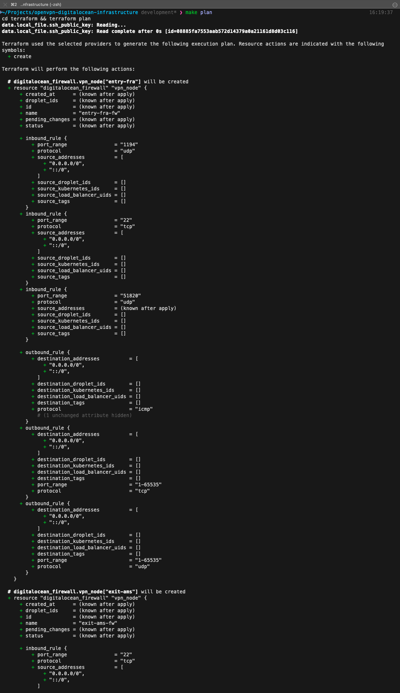

---

### 3. Terraform Apply

```bash
make apply
```

Screenshot the output showing `Apply complete! Resources: X added, 0 changed, 0 destroyed.` and the output values (node IPs, chain summary).

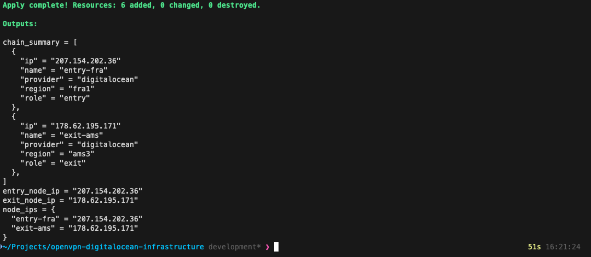

---

### 4. DigitalOcean Dashboard

Open the DigitalOcean web console at [cloud.digitalocean.com](https://cloud.digitalocean.com/). Screenshot the **Droplets** page showing the provisioned nodes with their names, regions, and IP addresses matching the Terraform output.

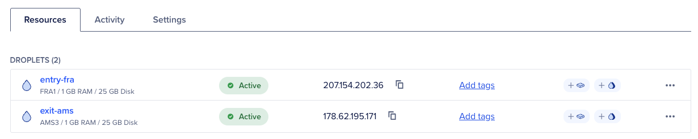

---

### 5. PKI Initialization

```bash
make pki-init
```

Screenshot the output showing Easy-RSA download, CA creation, and DH parameter generation.

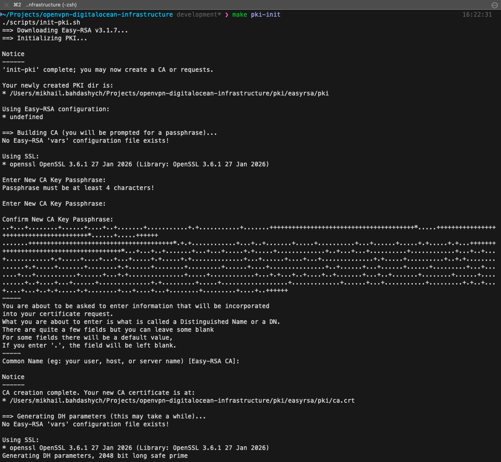

---

### 6. Server Certificate Generation

```bash
make server-cert
```

Screenshot the output showing the server certificate being generated and signed.

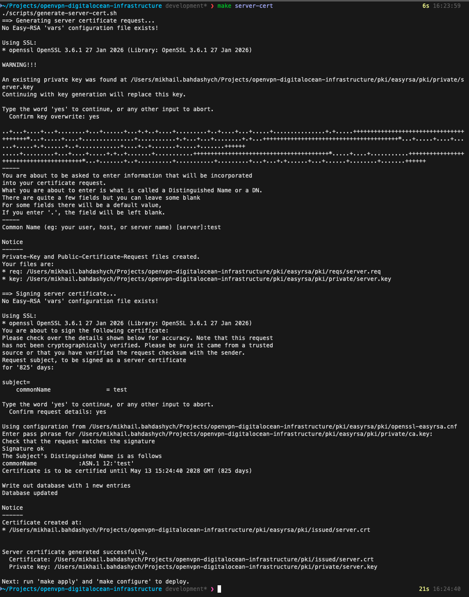

---

### 7. Ansible Configure

```bash
make configure
```

Screenshot the Ansible play recap at the end of the run, showing all hosts with `ok` and `changed` counts and zero `failed`.

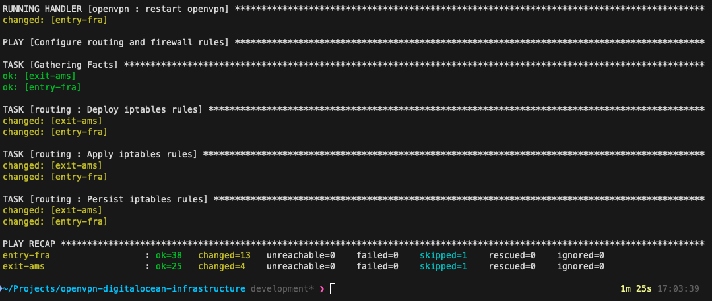

---

### 8. WireGuard Tunnel Status

```bash
cd ansible && ansible all -m shell -a "wg show" -i inventory/hosts.yml
```

Screenshot the output on each node showing active WireGuard interfaces, peer public keys, allowed IPs, and a **recent handshake** timestamp (indicates the tunnel is live).

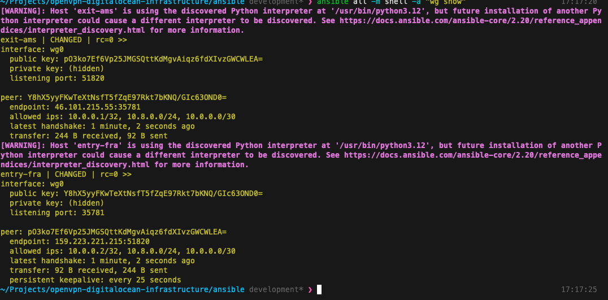

---

### 9. Client Certificate Generation

```bash
make client-cert CLIENT=test
```

Screenshot the output showing the client certificate being generated and signed.

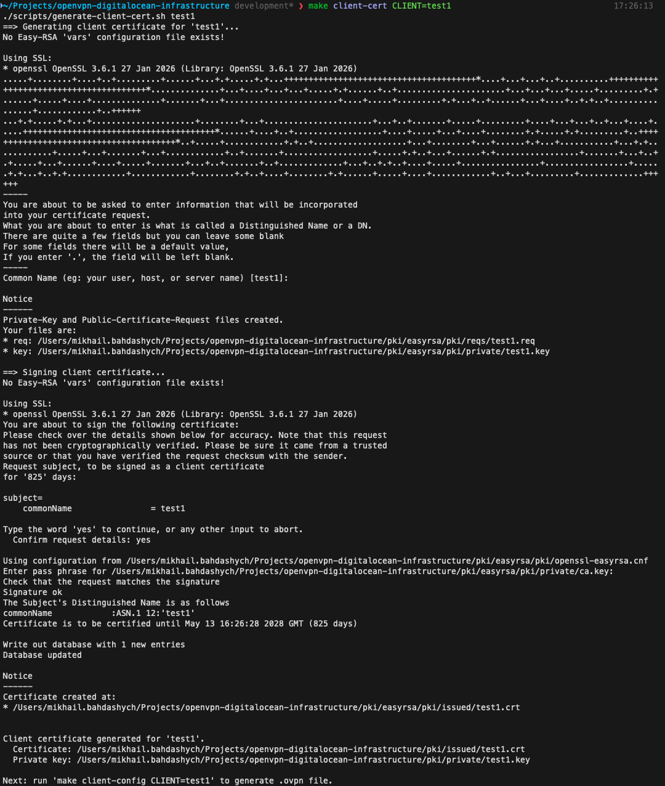

---

### 10. Client Config Generation

```bash
make client-config CLIENT=test
```

Screenshot the output showing the `.ovpn` file path and confirmation message.

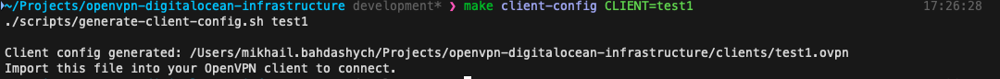

---

### 11. OpenVPN Client Connected

```bash
sudo openvpn --config clients/test.ovpn
```

Screenshot the OpenVPN client log showing `Initialization Sequence Completed` and the assigned `10.8.0.x` address. If using a GUI client (Tunnelblick, OpenVPN Connect), screenshot the connected status.

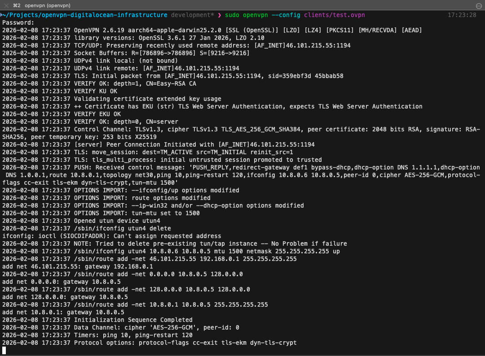

---

### 12. Exit IP Verification

While connected to the VPN, run:

```bash
curl -4 ifconfig.me
```

Screenshot showing that the returned IP address matches the **exit node's** public IP (not the entry node, and not your real IP). You can compare with the output of `terraform -chdir=terraform output -raw exit_node_ip`.

> **Note:** Use `curl -4` to force IPv4. The VPN tunnels only carry IPv4 traffic, so plain `curl` may resolve over IPv6 and bypass the tunnel entirely.

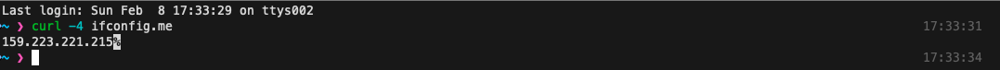

---

### 13. Ansible Status Ping

> **Important:** Disconnect from the VPN before running this command. While connected, the VPN tunnel routes traffic through the chain, which can make nodes unreachable via their public IPs from your machine.

```bash
make status
```

Screenshot showing `SUCCESS` pong responses from all nodes in the chain.

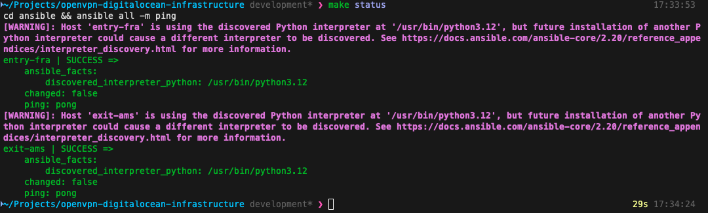

---

### 14. Terraform Destroy

```bash
make destroy
```

Screenshot the output showing `Destroy complete! Resources: X destroyed.` confirming clean teardown of all cloud resources.


---

## Repository Structure

```
multi-hop-vpn-infrastructure/
├── terraform/                          # Infrastructure provisioning
│   ├── main.tf                         # Module calls for DO and AWS nodes
│   ├── variables.tf                    # vpn_chain definition + credentials
│   ├── outputs.tf                      # Node IPs and chain summary
│   ├── versions.tf                     # Required providers (DO, AWS, local)
│   ├── providers.tf                    # Provider configs with AWS region aliases
│   ├── locals.tf                       # Computed node roles, tunnel pairs, IPs
│   ├── ssh.tf                          # SSH key resources (uses local key)
│   ├── firewalls.tf                    # DO firewalls + AWS security groups
│   ├── inventory.tf                    # Generates Ansible inventory YAML
│   └── modules/
│       ├── digitalocean-node/          # DO droplet resource
│       └── aws-node/                   # EC2 instance + Ubuntu AMI lookup
├── ansible/                            # Configuration management
│   ├── ansible.cfg                     # Ansible settings
│   ├── site.yml                        # Master playbook
│   ├── inventory/                      # (generated) Terraform-produced hosts.yml
│   │   ├── group_vars/
│   │   │   └── all.yml                 # Global variables
│   │   └── hosts.yml                   # (gitignored) Generated by Terraform
│   ├── roles/
│   │   ├── common/                     # OS hardening, fail2ban, sysctl
│   │   ├── wireguard/                  # WireGuard tunnels
│   │   ├── openvpn/                    # OpenVPN server (entry node)
│   │   └── routing/                    # iptables per node role
│   └── playbooks/
│       ├── 01-common.yml
│       ├── 02-wireguard.yml
│       ├── 03-openvpn.yml
│       └── 04-routing.yml
├── scripts/                            # PKI management
│   ├── init-pki.sh                     # Initialize local CA
│   ├── generate-server-cert.sh         # Server certificate
│   ├── generate-client-cert.sh         # Client certificate
│   └── generate-client-config.sh       # Produce .ovpn file
├── static/                             # Verification screenshots
├── pki/                                # (gitignored) Local CA directory
├── clients/                            # (gitignored) Generated .ovpn files
├── Makefile                            # Automation targets
├── terraform.tfvars.example            # Example configuration
├── .gitignore
├── README.md
└── LICENSE
```

---

## Security Considerations

### What This Project Does Well

- **CA private key stays local.** The Certificate Authority is initialized on your machine via Easy-RSA. The CA private key is never uploaded to any cloud node. Only the CA certificate (public) and signed server/client certificates are distributed.
- **WireGuard keys generated on-node by Ansible.** Private keys are created on each node using `wg genkey` and never leave the node. Only public keys are exchanged between peers. This keeps WireGuard secrets out of Terraform state.
- **Your own SSH key.** The project references your existing SSH public key rather than generating a new key pair in Terraform. No private key material exists in the state file.
- **Restrictive firewalls.** WireGuard ports (51820/udp) are only open to other nodes in the chain, not the public internet. OpenVPN (1194/udp) is only open on the entry node. SSH (22/tcp) is open for administration.
- **OS hardening.** All nodes receive fail2ban, SSH hardening (no password auth, no root login), and IPv6 is disabled to prevent leak vectors.

### What This Project Does Not Do

- **Multi-hop adds privacy, not encryption strength.** Each tunnel hop is independently encrypted, but the fundamental encryption strength is that of a single WireGuard or OpenVPN tunnel. The benefit is **traffic analysis resistance** — no single compromised node reveals the full picture.
- **Not anonymous against a global adversary.** If an attacker controls all nodes or can observe all network links simultaneously, they can correlate traffic. This is a general limitation of VPN-based privacy, not specific to this project.
- **Performance cost per hop.** Each additional relay adds latency (typically 1-5ms depending on geographic distance) and reduces throughput due to re-encryption overhead.

---

## Cost Estimates

Approximate monthly costs based on the cheapest supported instance types. Actual costs vary by region and usage.

| Chain Size | DigitalOcean (`s-1vcpu-1gb`) | AWS (`t3.micro`) | Mixed (DO entry + AWS exit) |
|-----------|-------------------------------|-------------------|------------------------------|
| 2 nodes   | ~$12/mo                       | ~$15/mo           | ~$13/mo                      |
| 3 nodes   | ~$18/mo                       | ~$22/mo           | ~$20/mo                      |
| 4 nodes   | ~$24/mo                       | ~$30/mo           | ~$26/mo                      |

---

## License

Licensed under the [MIT License](LICENSE).
